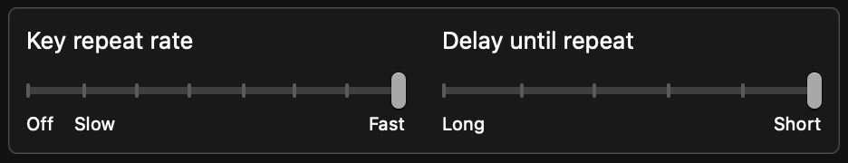
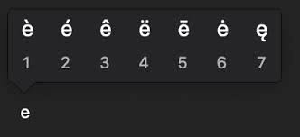

I edited these settings to increase browsing speed  
  

But I faced with this annoying popup  


To prevent:
``` shell
defaults write -g ApplePressAndHoldEnabled -bool false
```

:::caution
Need to logout
:::

You can enable again via:
``` shell
defaults write -g ApplePressAndHoldEnabled -bool true
```
